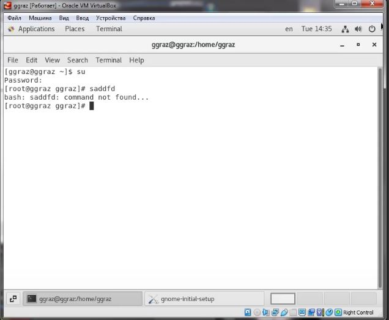

# Лабораторная работа №1
<!-- _class: fio -->
Разважный Георгий
НПИбд-02-19

## Цель работы
  Целью данной работы является приобретение практических навыков установки операционной системы на виртуальную машину, настройки минимально необходимых для дальнейшей работы сервисов.

### Выполнение лабораторной работы
1. Создал новую виртуальную машину. Указал имя виртуальной машины, размер основной памяти виртуальной машины — 2048 МБ.
Задал конфигурацию жёсткого диска — загрузочный, VDI, динамический виртуальный диск. Задала размер диска — 40 ГБ.

 
2.  Добавил новый привод оптических дисков и выбрала образ операционной системы. 

3. В разделе выбора программ указал в качестве базового окружения Server with GUI , а в качестве дополнения — Development Tools4. 

4. Включил сетевое соединение.

5. Установил пароль для root и пользователя с правами администратора.

  

  

6. Вошел в ОС под заданной при установке учётной записью. В меню Устройства виртуальной машины подключил образ диска дополнений гостевой ОС. 
 
  

7. Дождался загрузки графического окружения и открыла терминал. В окне терминала проанализировал последовательность загрузки системы, выполнив команду dmesg.

  

## Вывод
Приобрел практические навыки установки операционной системы на виртуальную машину, настройки минимально необходимых для дальнейшей работы сервисов.
