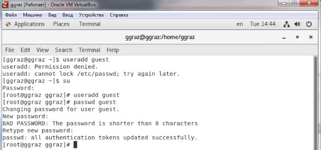
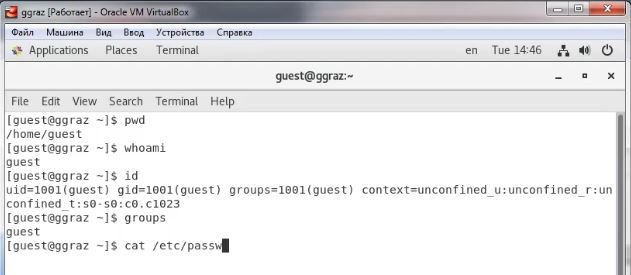
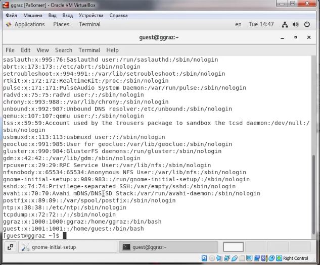
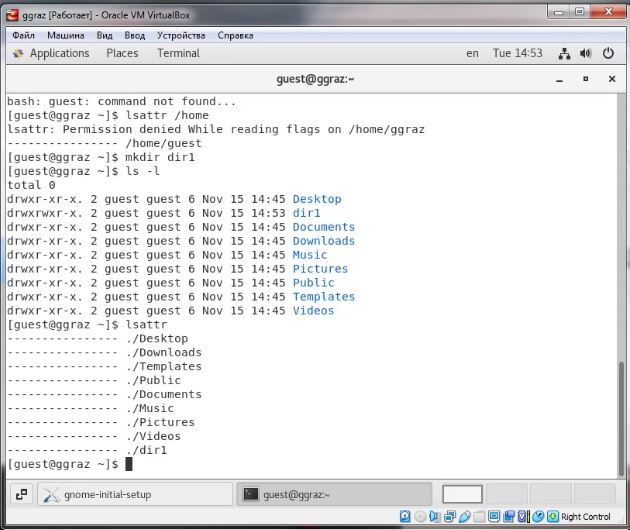
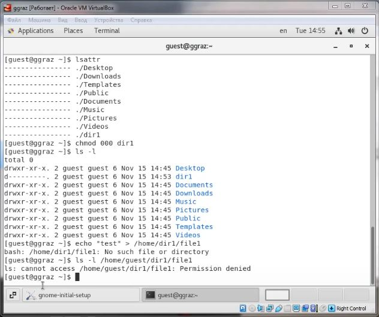

# Лабораторная работа №2
<!-- _class: fio -->
Разважный Георгий
НПИбд-02-19

---
## Цель работы
  Получение практических навыков работы в консоли с атрибутами файлов, закрепление теоретических основ дискреционного разграничения доступа в современных системах с открытым кодом на базе ОС Linux.

---
### Выполнение лабораторной работы
1. В установленной при выполнении предыдущей лабораторной работы операционной системе создал учётную запись пользователя guest. Задал пароль для пользователя guest.

---

2. Вошел в систему от имени пользователя guest.

3. Директория, в которой я нахожусь: /home/guest. Данная директория является домашней, что соответствует приглашению командной строки. Имя моего пользователя guest. С помощью команды id уточнила следующие данные: имя моего пользователя (guest), его группу (1001 - guest), группы, куда входит пользователь (1001 - guest). По сравнению с командой id команда groups показывает только название группы, в которую входит пользователь.

---

4. Просмотрел файл /etc/passwd. Нашла в нём свою учётную запись: uid и gid пользователя - 1001. Данные соотвутствуют тем, что были получены в предыдущих шагах.

---

5. Определил существующие в системе директории. Обе директории имеют права на чтение, запись и исполнение только для владельца директорий. Посмотреть расширенные атрибуты удалось только для пользователя guest. Они отсутствуют. Создал в домашней директории поддиректорию dir1.

6. Определил командами ls -l и lsattr, какие права доступа и расширенные атрибуты были выставлены на директорию dir1. Снял с директории dir1 все атрибуты и проверил с её помощью правильность выполнения команды ls -l.

7. Попытался создать в директории dir1 файл file1.

---

9. Заполнил таблицу «Установленные права и разрешённые действия».

---

10. На основании заполненной таблицы определил иные минимально необходимые права для выполнения операций внутри директории dir1.

---
## Вывод
Получил практические навыки работы в консоли с атрибутами файлов, закрепил теоретические основы дискреционного разграничения доступа в современных системах с открытым кодом на базе ОС Linux.
