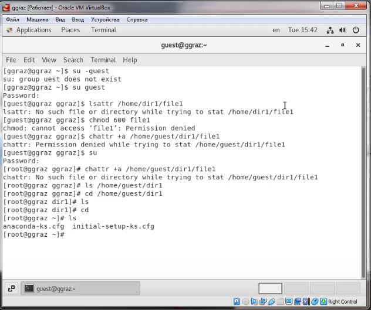
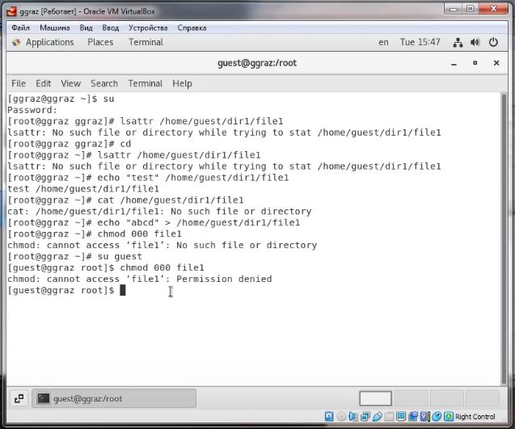
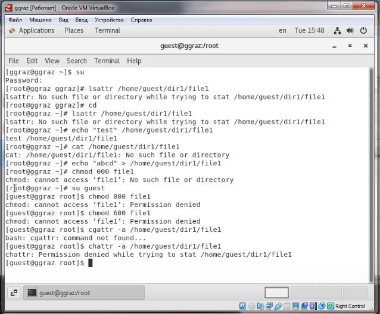

# Лабораторная работа №4
<!-- _class: fio -->
Разважный Георгий
НПИбд-02-19

---
## Цель работы
 Получение практических навыков работы в консоли с расширенными атрибутами файлов.

---

### Выполнение лабораторной работы
1. От имени пользователя guest определил расширенные атрибуты файла /home/guest/dir1/file. Установил командой на файл file1 права, разрешающие чтение и запись для владельца файла. (рис. 1)

 
 ---
2. Попробовал установить на файл/home/guest/dir1/file1 расширенный атрибут a от имени пользователя guest. Попробовал установить расширенный атрибут a на файл /home/guest/dir1/file1 от имени суперпользователя. От пользователя guest проверил правильность установления атрибута. Выполнил дозапись в файл file1 слова «test». После этого выполнил чтение файла file1. Убедился, что слово test было успешно записано в file1. Попробовал удалить файл file1. Попробовал переименовать файл. Попробовал установить на файл file1 права, например, запрещающие чтение и запись для владельца файла. Не удалось успешно выполнить указанные команды. Снял расширенный атрибут a с файла/home/guest/dirl/file1 от имени суперпользователя. Повторил операции, которые ранее не удавалось выполнить. Они были успешно исполнены (рис. 2-3).

---

3. Повторил действия по шагам,заменив атрибут «a» атрибутом «i». Дозаписать информацию не удалось (рис. 4).

---

## Вывод
Получил практические навыки работы в консоли с расширенными атрибутами файлов.
